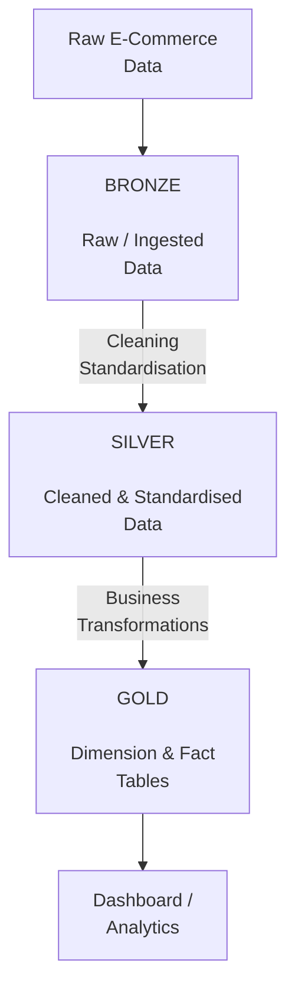

# E-Commerce ETL Data Engineering Project

An end-to-end **E-Commerce Data Engineering project** built using **Databricks, Apache Spark, PySpark, Delta Lake, and SQL**.

The project demonstrates how raw e-commerce data can be transformed into structured, analytics-ready datasets using the **Medallion Architecture (Bronze → Silver → Gold)**.

The main objective is to build a **scalable and maintainable ETL pipeline** that supports downstream analytics, reporting, and business intelligence.

---

## Project Overview

This project simulates a real-world data engineering workflow for processing e-commerce data.

The pipeline focuses on:

* Data ingestion
* Data cleaning and transformation
* Data validation
* Data modelling
* Dimension and fact table creation
* Medallion Architecture
* Delta Lake
* Apache Spark and PySpark
* SQL transformations
* Data quality and consistency
* Analytics-ready datasets
* Dashboard development

The project is implemented using **Databricks and Delta Lake**, providing a modern **Lakehouse-style data processing environment**.

---

## Architecture

The project follows the **Medallion Architecture**, where data moves through three processing layers:



### Data Flow

**Raw Data → Bronze → Silver → Gold → Analytics**

* **Bronze** – Raw and ingested data
* **Silver** – Cleaned, validated, and standardised data
* **Gold** – Business-ready dimension and fact tables
* **Analytics** – Dashboards and analytical reporting

---

## ETL Pipeline

The pipeline follows an **Extract → Transform → Load** workflow.

### 1. Extract

Raw e-commerce data is ingested into the data processing environment.

The original data is preserved in the Bronze layer so that it can be **reprocessed when required**.

### 2. Transform

Data is transformed using **PySpark and SQL**.

Key transformation activities include:

* Data cleaning
* Data type conversion
* Missing value handling
* Duplicate removal
* Column standardisation
* Dataset joins
* Derived column creation
* Business rule implementation
* Data validation
* Dimension and fact table preparation

### 3. Load

The transformed datasets are stored as **Delta tables**.

The Gold layer provides structured, business-ready datasets that can be consumed by analytics and reporting applications.

---

## Bronze Layer

The Bronze layer stores the **raw data ingested from source systems**.

The purpose of this layer is to preserve the original source data before applying transformations.

### Characteristics

* Raw data preservation
* Minimal transformation
* Source-level structure
* Reprocessable data
* Data lineage support

---

## Silver Layer

The Silver layer contains **cleaned, validated, and standardised data**.

Data is transformed from the Bronze layer using **Apache Spark, PySpark, and SQL**.

### Key Transformations

* Data cleaning
* Data type standardisation
* Null value handling
* Duplicate removal
* Data validation
* Dataset joins
* Column standardisation
* Derived column creation

The Silver layer provides a reliable foundation for downstream **data modelling and business transformations**.

---

## Gold Layer

The Gold layer contains **business-ready datasets** designed for analytics and reporting.

The project separates analytical data into **dimension tables** and **fact tables**.

### Dimension Tables

Dimension tables contain **descriptive information** that provides context for analysing business data.

Examples include:

* Products
* Brands
* Categories
* Other descriptive business entities

### Fact Tables

Fact tables contain **business events and measurable values** used to calculate business metrics.

Examples include:

* Sales quantities
* Sales amounts
* Transaction values
* Other measurable business data

The Gold layer is designed to make data easier and more efficient for **analysts, reporting tools, and business users** to query.

---

## Data Modelling

The project transforms transactional e-commerce data into analytical structures using a **dimensional modelling approach**.

```text
Raw Data
   ↓
Bronze
   ↓
Silver
   ↓
┌───────────────────┐
│   Gold Layer      │
│                   │
│ Dimension Tables  │
│        +          │
│   Fact Tables     │
└───────────────────┘
   ↓
Analytics
```

### Dimensional Model

* **Dimension tables** provide descriptive context.
* **Fact tables** store measurable business events and values.
* Together, they provide a structured foundation for analytical queries and reporting.

---

## Project Structure

```text
project_ecommerce_etl_processing/
│
├── 1_medallion_processing_dim/     # Dimension table processing
│
├── 3_medallion_processing_fact/    # Fact table processing
│
├── 4. Dashboard/                   # Dashboard and visualisation
│
├── set_up/                         # Project setup and configuration
│
└── README.md                       # Project documentation
```

### Directory Overview

| Directory                      | Description                                                           |
| ------------------------------ | --------------------------------------------------------------------- |
| `1_medallion_processing_dim/`  | Processes dimension data through the Bronze, Silver, and Gold layers. |
| `3_medallion_processing_fact/` | Processes fact data through the Bronze, Silver, and Gold layers.      |
| `4. Dashboard/`                | Contains dashboard and data visualisation components.                 |
| `set_up/`                      | Contains project setup and configuration files.                       |
| `README.md`                    | Project documentation and implementation details.                     |

---

## Technologies Used

| Technology                 | Purpose                                    |
| -------------------------- | ------------------------------------------ |
| **Databricks**             | Data engineering and processing platform   |
| **Apache Spark**           | Distributed data processing                |
| **PySpark**                | Python-based Spark transformations         |
| **SQL**                    | Data transformation and analytical queries |
| **Delta Lake**             | Reliable storage and table management      |
| **Python**                 | Data processing and automation             |
| **Medallion Architecture** | Lakehouse data architecture                |
| **Dashboard**              | Data visualisation and analytics           |

---

## Why Databricks?

**Databricks** provides a unified environment for building scalable data pipelines using Apache Spark.

In this project, Databricks is used for:

* Spark-based data processing
* PySpark development
* SQL analytics
* Delta Lake tables
* Data transformation
* ETL pipeline development
* Lakehouse architecture

---

## Why Delta Lake?

**Delta Lake** provides reliability and data management capabilities on top of data lake storage.

This project uses Delta Lake to support:

* ACID transactions
* Reliable data updates
* Schema enforcement and management
* Data versioning
* Time travel
* Consistent analytical datasets

These capabilities make Delta Lake suitable for building **reliable and maintainable Lakehouse data pipelines**.

---

## Key Data Engineering Concepts Demonstrated

### Data Engineering

* ETL pipelines
* Data ingestion
* Data transformation
* Data cleaning
* Data validation
* Data modelling
* Data quality
* Data lineage

### Big Data

* Apache Spark
* PySpark
* Distributed data processing
* Spark SQL

### Lakehouse

* Medallion Architecture
* Delta Lake
* Bronze / Silver / Gold layers

### Data Warehousing

* Dimension tables
* Fact tables
* Dimensional modelling
* Business-ready datasets

### Analytics

* SQL queries
* Aggregations
* Business metrics
* KPI analysis
* Dashboard development

---

## Dashboard

The Gold-layer datasets are used to create analytical dashboards.

The dashboard provides a high-level view of the processed e-commerce data and enables users to explore **business metrics, trends, and insights**.

---

## Skills Demonstrated

This project demonstrates practical experience with:

* Databricks
* Apache Spark
* PySpark
* SQL
* Delta Lake
* ETL Pipeline Development
* Data Modelling
* Medallion Architecture
* Data Warehousing
* Data Quality
* Data Analytics
* Dashboard Development

---

## Conclusion

This project demonstrates an end-to-end **Data Engineering workflow**, from raw data ingestion through data transformation, modelling, and analytics.

By combining **Databricks, Apache Spark, PySpark, SQL, Delta Lake, and the Medallion Architecture**, the project provides a scalable foundation for building reliable and analytics-ready e-commerce data pipelines.
